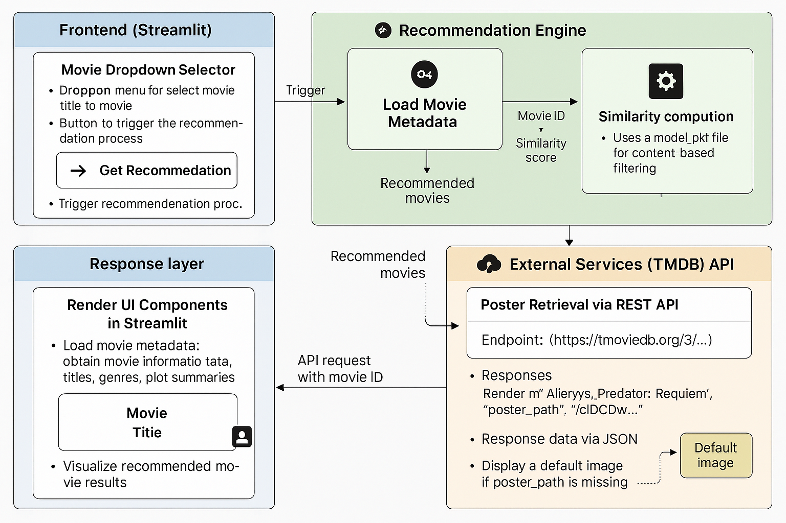
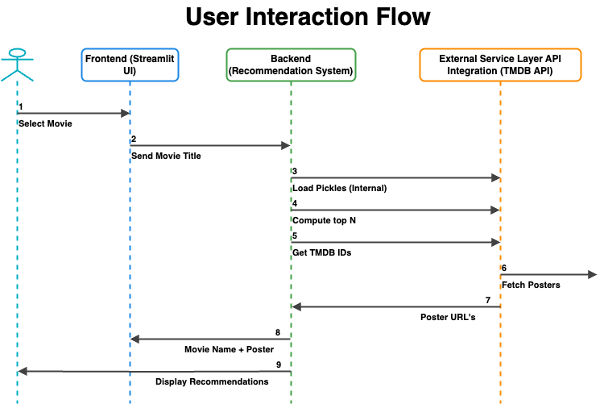
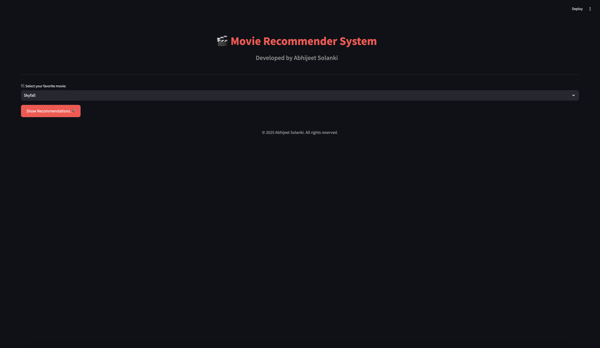

# 🎬 Movie Recommender System  
**Developed by Abhijeet Solanki**

## 🔍 Overview  
The Movie Recommender System is a web app that suggests **5 similar movies** based on a user’s selected favorite film. It's designed to skip the endless scrolling and decision fatigue by using content-based filtering with intuitive visuals.

---
## 🗂️ Dataset
For this recommender system, I have used the TMDB 5000 Movie Dataset. Before proceeding, first download the dataset from the URL below:

URL: https://www.kaggle.com/datasets/tmdb/tmdb-movie-metadata


## 🧠 System Architecture  



### 📌 Components:
#### 1. **Frontend (Streamlit)**  
- Dropdown to select a movie  
- Button to trigger recommendations  
- Renders titles and posters interactively  

#### 2. **Backend (Recommendation Engine)**  
- Loads metadata from `model.pkl`  
- Computes similarity scores using content-based filtering  
- Retrieves the top 5 movie recommendations  

#### 3. **External API (TMDB)**  
- Fetches high-quality posters using TMDB’s REST API  
- Displays a default image if a poster is missing  

---

## 🔁 User Interaction Flow  



1. The user selects a movie via a dropdown.  
2. Frontend sends the movie title to the backend.  
3. Backend loads metadata and the similarity model.  
4. Computes the top 5 similar movies.  
5. Fetches poster URLs via TMDB API.  
6. Frontend renders recommendations dynamically.  

---

## 🖥️ Live Demo Screenshots  

**🔽 Selection Interface**  


**🎥 Recommendations**  


---

## 🎬 User Demo  


---
## 🛠 Tech Stack  
- **Frontend**: Streamlit  
- **Backend**: Python, Pickle (for similarity model)  
- **API**: TMDB REST API (for movie posters)  
- **Libraries**: `pandas`, `numpy`, `sklearn`, `requests`, `streamlit`
---

## 📂 Repository Structure  
```bash
├── app.py                      # Streamlit frontend
├── MovieRecommenderSystem.ipynb # Backend logic & model creation
├── model.pkl                   # Precomputed similarity matrix
├── poster_fetcher.py           # TMDB API integration (optional)
├── requirements.txt
└── README.md
```
## 🚀 How to Run Locally
Clone the repo
```bash
git clone https://github.com/ChiefAj23/Movie-Recommender-System.git
cd Movie-Recommender-System
```
Install dependencies
```bash
pip install -r requirements.txt
```
Run the app
```bash
streamlit run app.py
```

## 📢 Future Features
- Add user-based collaborative filtering.
- Allow genre-based filtering.
- Display movie plots and ratings.
- Add user login, and the user can rate movies.
- Enable trailer previews.

## 📣 Let's Connect
If you enjoyed this or have suggestions, feel free to reach out!
Abhijeet Solanki
